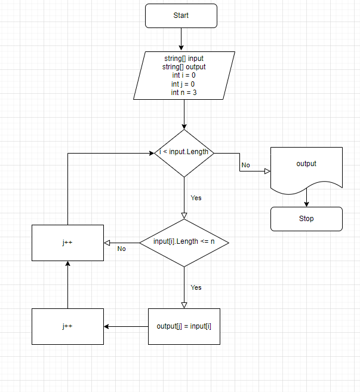

# Контрольная работа

## Задача:
Написать программу, которая из имеющегося массива строк формирует новый массив из строк, длина которых меньше или равна 3 символам.
Первоначальный массив можно ввести с клавиатуры, либо задать на старте выполнения алгоритма. 

**При решении не рекомендуется пользоваться ~~коллекциями~~, лучше обойтись исключительно массивами.**

## Алгоритм решения:
1. Перебираем значения исходного массива.
2. Проверяем каждое знаение массива по очереди на соответствие условию: длинна строки меньше или равна трем.
3. При выполнении условий выбранной строкой из исходного массива, кладем данное значение в новый массив.
4. Повторяем пункты 2 и 3 пока не достигнем конца исходного массива.
5. Возращаем новый заполненый массив как результат.

*Добавили блок-схему алгоритма*
